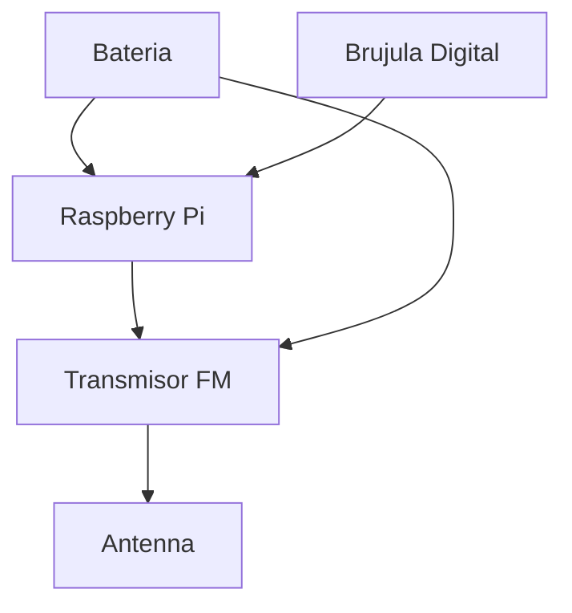

# Diagramas

En este documento encontrarás los diagramas del proyecto.

## Conexión general
Este diagrama esta hecho en Mermaid para MarkDown.

```mermaid
graph TD;
    Tx2[Transmisor FM] --> Tx1[Antenna]
    Rp[Raspberry Pi] --> Tx2
    Bt[Bateria] --> Rp
    Mg[Brujula Digital] --> Rp;

    Bt --> Tx2;
```