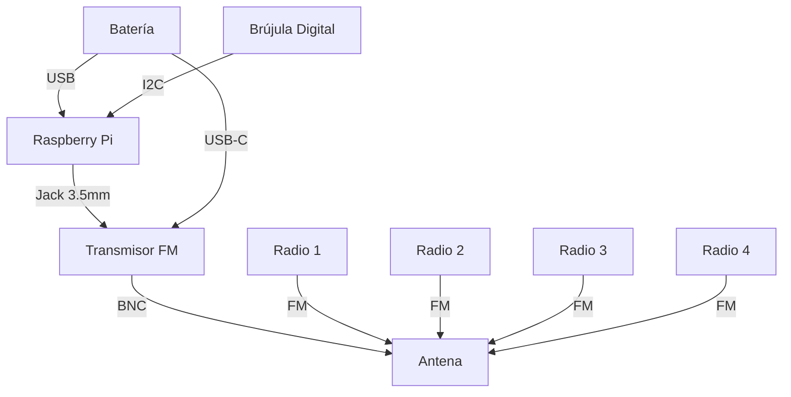

# Diagramas

En este documento encontrarás los diagramas del proyecto.

## Conexión general
Este diagrama esta hecho en Mermaid para MarkDown.


## Conexión del sensor

Se usará un sensor GY-87 vía I2C, el cual se representa con la siguiente tabla
```
GY-87   Raspberry Pi
Vcc---->3.3V
GND---->GND
SDA---->GPIO2 (SDA)
SCL---->GPIO3 (SCL)
```
Si tienes duda cuales son los pines de cada sensor, consulta su pinout.

- [Raspberry Pi Pinout]()
- [GY-87 Pinout]()